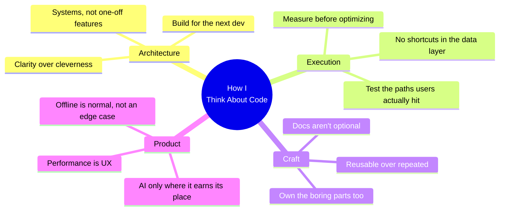

<!-- <div align="center">


</div>

<div align="center">

```
 ░██████╗░█████╗░██╗░░██╗░██████╗██╗░░██╗░█████╗░███╗░░░███╗
 ██╔════╝██╔══██╗██║░██╔╝██╔════╝██║░░██║██╔══██╗████╗░████║
 ╚█████╗░███████║█████═╝░╚█████╗░███████║███████║██╔████╔██║
 ░╚═══██╗██╔══██║██╔═██╗░░╚═══██╗██╔══██║██╔══██║██║╚██╔╝██║
 ██████╔╝██║░░██║██║░╚██╗██████╔╝██║░░██║██║░░██║██║░╚═╝░██║
 ╚═════╝░╚═╝░░╚═╝╚═╝░░╚═╝╚═════╝░╚═╝░░╚═╝╚═╝░░╚═╝╚═╝░░░░╚═╝
```

</div>

<div align="center">


</div>

<br/>

<div align="center">

[](https://linkedin.com/in/saksham-pandey21)
[](mailto:pandeysaksham21s@gmail.com)
[](https://github.com/saksham-pandeyy)
[](https://github.com/saksham-pandeyy)

<br/>

<div>


</div>

</div>

---

<br/>

## Who I Am


I work across four layers most engineers only touch one or two of — **web**, **React Native**, **SDKs**, and the **backend** underneath them — and I've shipped in all of them to real, live users, not just a staging build.

Day to day that means moving between a Next.js dashboard that needs to feel instant, a React Native app that has to keep working when the network doesn't, an Express/MongoDB API tying it all together, and the SDK layer that quietly holds everything else in sync. I like the unglamorous parts of that stack the most — sync logic, retry handling, the edge case that only shows up in production.

**What I actually spend my time on:**

- Owning a feature end-to-end — Node/Express/MongoDB on the backend through to React or React Native on the frontend — when a project needs one person across the stack
- Making offline-first mobile apps survive bad networks without losing user data
- Building SDKs that other developers can integrate without reading my source code first
- Wiring AI into product flows in a way that earns its place, not as a gimmick
- Writing frontend architecture that the next engineer (or future me) won't curse at

<br/><br/><br/>

---

<br/>

## Technical Stack

<div align="center">

### Core


### Backend


### Ecosystem


</div>

<br/>

<div align="center">

| Layer | Technologies |
|---|---|
| **Web** | React · Next.js · TypeScript · Tailwind CSS |
| **Mobile** | React Native · Android · iOS · Expo |
| **Backend** | Node.js · Express · MongoDB · REST API design |
| **SDK** | SDK architecture · Versioning · Consumer-facing API design |
| **State** | Zustand · Redux Toolkit · TanStack Query |
| **Data / Offline** | WatermelonDB · IndexedDB · LocalStorage |
| **API** | Auth Flows · Token Management · Pagination |
| **AI** | OpenAI SDK · Tool Calling · Structured Outputs · LangGraph |

</div>

<br/>

---

<br/>

## What I Build

<table>
<tr>
<td width="50%" valign="top">

### Web & Fullstack

I build the parts of a web app that are boring to describe and hard to get right — component architecture that survives a year of feature requests, an Express/MongoDB API underneath it, and performance that's measured, not assumed.

**In practice:**
- Dashboards and internal tools people actually use daily
- End-to-end features: Node/Express/MongoDB API through to the React UI consuming it
- Design systems that don't fall apart on the third feature
- Performance work grounded in real metrics, not guesses

</td>
<td width="50%" valign="top">

### Mobile

React Native apps that keep functioning when connectivity doesn't — because for most users, "offline" isn't an edge case, it's Tuesday.

**In practice:**
- Offline-first apps with background sync and conflict resolution
- Navigation and state architecture for apps with real complexity
- Shipped Android and iOS builds, not just simulator demos

</td>
</tr>
<tr>
<td width="50%" valign="top">

### SDK Engineering

Building the layer other developers integrate against — where a confusing API or an undocumented edge case becomes someone else's production bug.

**In practice:**
- SDK design with consumer developer experience as a first-class concern
- Consistent, predictable APIs across web and mobile consumers
- Clear failure modes instead of silent errors

</td>
<td width="50%" valign="top">

### AI Integrations

AI features that solve an actual product problem — not a chatbot bolted on for the sake of having one.

**In practice:**
- OpenAI API with tool calling and structured outputs
- AI-assisted workflows built into existing product flows
- Context management across multi-turn interactions
- Currently digging into: LangGraph, agentic workflows

</td>
</tr>
</table>

<br/>

---

<br/>

## Engineering Philosophy



<br/>

---

<br/>

## Currently

```yaml
status: "Building and shipping — day job + side projects"

working_on:
  - React Native architecture patterns that scale past one app
  - Offline-first sync with real conflict resolution, not just retry loops
  - SDK design that other developers don't have to fight
  - AI-assisted product workflows

learning:
  - LangGraph and agentic workflow design
  - Frontend system design at scale
  - Modern AI infrastructure patterns

open_to:
  - Frontend Engineer · React Developer · React Native Developer
  - Product Engineer · Software Engineer
  - Remote · Contract · Full-Time
```

<br/>

---

<br/>

## GitHub Analytics

<div align="center">


&nbsp;


</div>

<br/>

<div align="center">


</div>

<br/>

<div align="center">


</div>
<br/>

---

<br/>

## Let's Connect

<div align="center">

Open to talking through interesting problems, architecture decisions, or opportunities — reach out if any of the above sounds relevant to what you're building.

<br/>

[](https://linkedin.com/in/saksham-pandey21)
&nbsp;
[](mailto:pandeysaksham21s@gmail.com)
&nbsp;
[](https://github.com/saksham-pandeyy)

<br/>

> *"Good software is built twice — first in architecture, then in code."*

<br/>

</div>

<div align="center">


</div> -->


<div align="center">


</div>

<div align="center">

```
 ░██████╗░█████╗░██╗░░██╗░██████╗██╗░░██╗░█████╗░███╗░░░███╗
 ██╔════╝██╔══██╗██║░██╔╝██╔════╝██║░░██║██╔══██╗████╗░████║
 ╚█████╗░███████║█████═╝░╚█████╗░███████║███████║██╔████╔██║
 ░╚═══██╗██╔══██║██╔═██╗░░╚═══██╗██╔══██║██╔══██║██║╚██╔╝██║
 ██████╔╝██║░░██║██║░╚██╗██████╔╝██║░░██║██║░░██║██║░╚═╝░██║
 ╚═════╝░╚═╝░░╚═╝╚═╝░░╚═╝╚═════╝░╚═╝░░╚═╝╚═╝░░╚═╝╚═╝░░░░╚═╝
```

</div>

<div align="center">


</div>

<br/>

<div align="center">

[](https://linkedin.com/in/saksham-pandey21)
[](mailto:pandeysaksham21s@gmail.com)
[](https://github.com/saksham-pandeyy)
[](https://github.com/saksham-pandeyy)

<br/>

<div>


</div>

</div>

---

<br/>

## Who I Am


I work across four layers most engineers only touch one or two of — **web**, **React Native**, **SDKs**, and the **backend** underneath them — and I've shipped in all of them to real, live users, not just a staging build.

Day to day that means moving between a Next.js dashboard that needs to feel instant, a React Native app that has to keep working when the network doesn't, an Express/MongoDB API tying it all together, and the SDK layer that quietly holds everything else in sync. I like the unglamorous parts of that stack the most — sync logic, retry handling, the edge case that only shows up in production.

**What I actually spend my time on:**

- Owning a feature end-to-end — Node/Express/MongoDB on the backend through to React or React Native on the frontend — when a project needs one person across the stack
- Making offline-first mobile apps survive bad networks without losing user data
- Building SDKs that other developers can integrate without reading my source code first
- Wiring AI into product flows in a way that earns its place, not as a gimmick
- Writing frontend architecture that the next engineer (or future me) won't curse at

<br/><br/><br/>

---

<br/>

## Technical Stack

<div align="center">

### Core


### Backend


### Ecosystem


</div>

<br/>

<div align="center">

| Layer | Technologies |
|---|---|
| **Web** | React · Next.js · TypeScript · Tailwind CSS |
| **Mobile** | React Native · Android · iOS · Expo |
| **Backend** | Node.js · Express · MongoDB · REST API design |
| **SDK** | SDK architecture · Versioning · Consumer-facing API design |
| **State** | Zustand · Redux Toolkit · TanStack Query |
| **Data / Offline** | WatermelonDB · IndexedDB · LocalStorage |
| **API** | Auth Flows · Token Management · Pagination |
| **AI** | OpenAI SDK · Tool Calling · Structured Outputs · LangGraph |

</div>

<br/>

---

<br/>

## What I Build

<table>
<tr>
<td width="50%" valign="top">

### Web & Fullstack

I build the parts of a web app that are boring to describe and hard to get right — component architecture that survives a year of feature requests, an Express/MongoDB API underneath it, and performance that's measured, not assumed.

**In practice:**
- Dashboards and internal tools people actually use daily
- End-to-end features: Node/Express/MongoDB API through to the React UI consuming it
- Design systems that don't fall apart on the third feature
- Performance work grounded in real metrics, not guesses

</td>
<td width="50%" valign="top">

### Mobile

React Native apps that keep functioning when connectivity doesn't — because for most users, "offline" isn't an edge case, it's Tuesday.

**In practice:**
- Offline-first apps with background sync and conflict resolution
- Navigation and state architecture for apps with real complexity
- Shipped Android and iOS builds, not just simulator demos

</td>
</tr>
<tr>
<td width="50%" valign="top">

### SDK Engineering

Building the layer other developers integrate against — where a confusing API or an undocumented edge case becomes someone else's production bug.

**In practice:**
- SDK design with consumer developer experience as a first-class concern
- Consistent, predictable APIs across web and mobile consumers
- Clear failure modes instead of silent errors

</td>
<td width="50%" valign="top">

### AI Integrations

AI features that solve an actual product problem — not a chatbot bolted on for the sake of having one.

**In practice:**
- OpenAI API with tool calling and structured outputs
- AI-assisted workflows built into existing product flows
- Context management across multi-turn interactions
- Currently digging into: LangGraph, agentic workflows

</td>
</tr>
</table>

<br/>

---

<br/>

## Engineering Philosophy


<br/>

---

<br/>

## Currently

```yaml
status: "Building and shipping — day job + side projects"

working_on:
  - React Native architecture patterns that scale past one app
  - Offline-first sync with real conflict resolution, not just retry loops
  - SDK design that other developers don't have to fight
  - AI-assisted product workflows

learning:
  - LangGraph and agentic workflow design
  - Frontend system design at scale
  - Modern AI infrastructure patterns

open_to:
  - Frontend Engineer · React Developer · React Native Developer
  - Product Engineer · Software Engineer
  - Remote · Contract · Full-Time
```

<br/>

---

<br/>

## GitHub Analytics

<div align="center">


&nbsp;


</div>

<br/>

<div align="center">


</div>

<br/>

<div align="center">


</div>
<br/>

---

<br/>

## Let's Connect

<div align="center">

Open to talking through interesting problems, architecture decisions, or opportunities — reach out if any of the above sounds relevant to what you're building.

<br/>

[](https://linkedin.com/in/saksham-pandey21)
&nbsp;
[](mailto:pandeysaksham21s@gmail.com)
&nbsp;
[](https://github.com/saksham-pandeyy)

<br/>

> *"Good software is built twice — first in architecture, then in code."*

<br/>

</div>

<div align="center">


</div>
